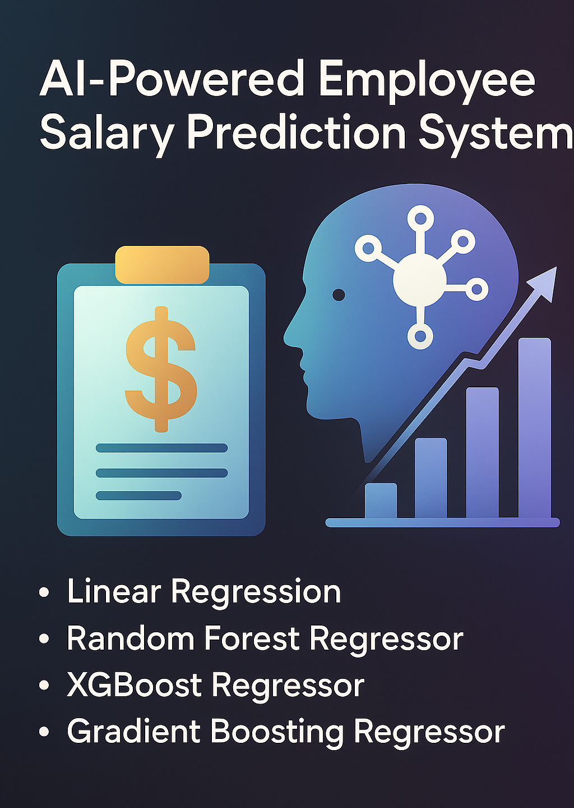

# SmartPay: AI-Powered Employee Salary Prediction System



SmartPay is a Machine Learning-powered application designed to predict monthly employee salaries based on features such as:

- Years of Experience
- Education Level
- Hours Worked Per Week

It supports both single and bulk predictions and is built with a clean, interactive Streamlit UI.

---

## Dataset

The model was trained using a custom-generated dataset (`employee_salary_prediction_dataset.csv`) that simulates realistic salary data based on the above features.

---

## Models Used

We experimented with the following regression algorithms:

- Linear Regression
- Polynomial Regression
- XGBoost Regressor
- Support Vector Regressor (SVR)
- Gradient Boosting Regressor

### Model Evaluation Metrics

| Model                   | MAE      | R² Score | RMSE     |
|------------------------|----------|----------|----------|
| Linear Regression       | 1444.51  | 0.99587  | 2215.50  |
| Polynomial Regression   | 1502.48  | 0.99544  | 2327.95  |
| XGBoost Regressor       | 3959.43  | 0.95007  | 7703.76  |
| SVR                     | 23543.61 | 0.17240  | 31362.77 |
| Gradient Boosting       | 3655.60  | 0.95915  | 6967.70  |


---

## Visual Results

| Actual vs Predicted | PDP for Gradient Boosting |
|---------------------|---------------------------|
|  |  |

---

## Streamlit Application

You can run the Streamlit app locally using:

```bash

streamlit run streamlit_salary_app.py

```

### Features

- Single & bulk predictions
- Feature importance illustrations
- Salary estimate in ₹ (INR)
- CSV upload and download support

---

## Project Structure

```
SmartPay/
├── employee_salary_prediction_dataset.csv
├── streamlit_salary_app.py
├── model_performance.txt
├── best_model.pkl
├── prediction.ipynb
├── plots/
│   ├── gradient_boosting_pdp.png
│   ├── Linear Regression_actual_vs_predicted.png
│   └── Model_Comparison.png
├── smartpay_banner.png
└── README.md
```

---

## References

- [Scikit-learn Documentation](https://scikit-learn.org/stable/documentation.html)
- [XGBoost Official Docs](https://xgboost.readthedocs.io/en/stable/)
- [Streamlit.io](https://streamlit.io/)
- [SHAP (Explainable AI)](https://shap.readthedocs.io/en/latest/)
- [IBM SkillsBuild AI Internship](https://skillsbuild.org/)

---

## Developed By:

**Srishti Bhatnagar**  

